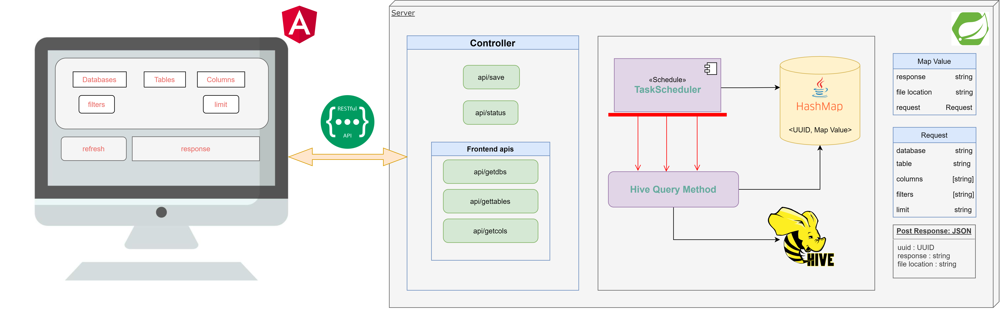

# Hive Data Consumption Application
# Overview
The aim is to develop a Web Application functional with REST APIs for consuming data from hive datawarehouse

This app will query the hive data warehouse using requested columns, filters and limit. It will return all the information in form of a file to the user.

# [Table of Contents](#table-of-contents)
- [Functionalities](#functionalities)
- [Architecture](#architecture)
- [Client](#client)
- [Server](#server)
  * [Apis and its description](#apis-and-its-description)
    + [Form Submission API](#form-submission-api)
    + [Status API](#status-api)
    + [Get Databases API](#get-databases-api)
    + [Get Tables API](#get-tables-api)
    + [Get Columns API](#get-columns-api)
  * [Support methods](#support-methods)
    + [Validation](#validation)
    + [Task Schduler](#task-schduler)
- [Technologies used](#technologies-used)
- [How to run?](#how-to-run-)
- [Swagger Documentation](#swagger-documentation)
- [Future Goals](#future-goals)
- [Acknowledgement](#acknowledgement)

# Functionalities
Query a single hive table using column names, apply filters using where clause and add limit. 

# Architecture

<!-- 
# Client

### UI with form submission response

### UI with refresh response - Started and Running

### UI with refresh response - Completed
 -->

# Server

## Apis and its description
We have multiple REST APIs for different functions.
### Form Submission API
-   It is a POST api
-   `Aim`: To save the details of form submitted by the user, validate the details and return the file location in which query results will be stored and UUID to the user
-   Can be hit using `localhost:8080/api/save`. It is called on form submit by the user
-   All the information submitted by user through the form is given in a JSON format in the body of the api as shown below 
<pre>
<code>
{
    "columns": ["name", "age"],
    "filters": ["name"],
    "limit": "100",
    "table": "medicare_demographic",
    "db": "default"
}
</code>
</pre>

-   A UUID is assigned to submitted `Request`
-   A response `Valid` is added to this `Request` and stored as `GetResponse`
-   An Example of `GetResponse` object is shown below.
<pre>
<code>
{
    response:Valid,
    columns:[name, age],
    filters:[name],
    limit:100,
    table:medicare_demographic,
    database:default
}
</code>
</pre>
-   The above `GetResponse` is stored in a map `<UUID, GetResponse>`. This map will contain the updated status of hive query from the backend
-   An example of `RequestMap` is shown below
<pre>
<code>
{
    2a5c211d-5b24-43ac-b1f4-362d3b3abe1d : 
    {
        response:Valid,
        columns:[name, age],
        filters:[name],
        limit:100,
        table:medicare_demographic,
        database:default
    }
}
</code>
</pre>
-   Validate the `Request` and return the UUID, file location and response to the user

### Status API
-   It is a GET api
-   `Aim`: To return the current status of query from the hashmap
-   Can be hit using `localhost:8080/api/status/{UUID}`. It is called on refresh button click by the user

### Get Databases API
-   It is a GET api
-   `Aim`: To return list of databases collected from the hive warehouse
-   Can be hit using `localhost:8080/api/getdbs`

### Get Tables API
-   It is a GET api
-   `Aim`: To return list of tables collected from the hive warehouse for a particular database
-   Can be hit using `localhost:8080/api/gettables/{db}`

### Get Columns API
-   It is a POST api
-   It takes in the database name and table name as its payload
-   `Aim`: To return list of columns collected from the hive warehouse for a particular database and table
-   Can be hit using `localhost:8080/api/getcols`

## Support methods

### Validation
-   `input params`: Array of column names, Array of filters, limit, source name, database name
-   It will check if source and database exists in the data warehouse
-   It will then check if the given columns exists in given database and the limit provided is valid
-   It will also run the data type matching function
-   It uses regex pattern matcher for appropriate data type matching and left and right clauses of a filter condition
-   Wholsome checks have been used to validate the LHS of filter, the in-between operator type followed by data type check based on LHS columns, all of which together make the system safe to sql injections
-   Appropriate error/valid conditions are set as the returning message, which in turn is used to set the response variable to be added to the global hashmap

### Task Scheduler
-   It is scheduled to run for every 1 sec.
-   It will get the UUID key with value `Valid` from the hashmap and run the query according to the `Request` and update the value as `Started and Running` in the hashmap
-   It will update the response of query in hashmap as `Complete` or `Failure` on the successful or unsuccessful query completion respectively
-   It will write 'No records found' in the generated file if the validation and query execution is successful but number of matching records is null

# Technologies used
-   Spring boot
-   JDK 8
-   Hive Query Language
-   Angular
-   TypeScript
-   HTML/CSS
-   Apache Hadoop
-   Apache Hive
-   Maven
-   Spring boot Swagger UI

# How to run?
-   On windows
    -   Run server, using maven: `.\mvnw spring-boot:run`
    -   Run client, using ng: `ng serve`

# Swagger Documentation
-   hit `localhost:8080/swagger-ui.html`

<small>Thanks to <a href='https://github.com/Ishita-0112'>Ishita</a> and <a href='https://github.com/ParnikaKulkarni'>Parnika</a> for contributing robust validation and query method and other rest apis</small>
<small><i><a href='http://ecotrust-canada.github.io/markdown-toc/'>Table of contents generated with markdown-toc</a></i></small>
